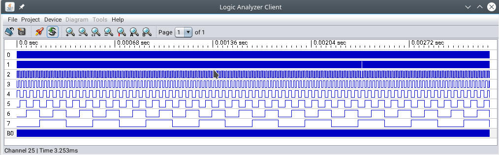
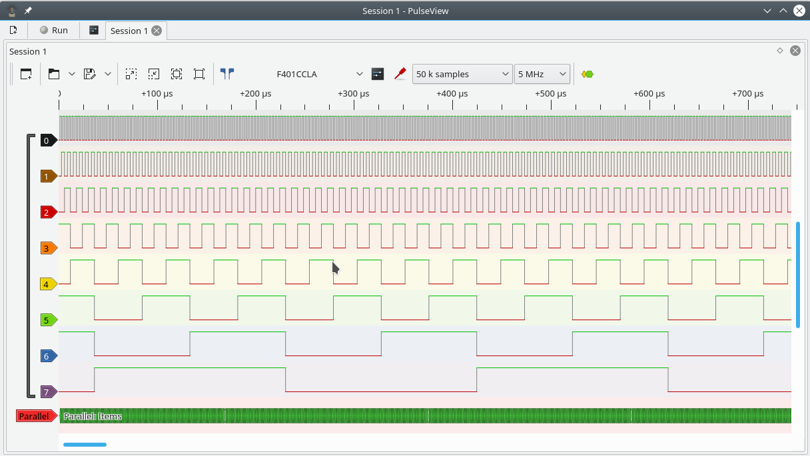

# SUMP compatible logic analyzer for STM32duino (steve's libmaple core) - stm32f401cc pill board

This is an implementation of (yet another) logic analyzer based on the sump protocol on STM32duino
 ([steves libmaple core](https://github.com/stevstrong/Arduino_STM32)) for STM32F401CC pill board.

## No warranty

THE SOFTWARE IS PROVIDED "AS IS", WITHOUT WARRANTY OF ANY KIND, EXPRESS OR IMPLIED, 
INCLUDING BUT NOT LIMITED TO THE WARRANTIES OF MERCHANTABILITY, FITNESS FOR A PARTICULAR 
PURPOSE AND NONINFRINGEMENT. IN NO EVENT SHALL THE AUTHORS OR COPYRIGHT HOLDERS BE LIABLE 
FOR ANY CLAIM, DAMAGES OR OTHER LIABILITY, WHETHER IN AN ACTION OF CONTRACT, TORT OR OTHERWISE, 
ARISING FROM, OUT OF OR IN CONNECTION WITH THE SOFTWARE OR THE USE OR OTHER DEALINGS IN THE SOFTWARE.   


### References / credits
many thanks goes to the various individuals (Roger, Steve, and many more et.al) who maintain the community (stm32duino) libmaple core that 
this is based on. it is a very impressive community effort with no big 'company' behind it. all that made 
from comunity contributions (including this implementation) that literally made this possible. 

- [STM32duino libmaple core - steve's repository github](https://github.com/stevstrong/Arduino_STM32)
- [STM32duino (roger's) libmaple core github](https://github.com/rogerclarkmelbourne/Arduino_STM32)
- [leaflabs libjmaple - the 'oldest' origin](http://docs.leaflabs.com/static.leaflabs.com/pub/leaflabs/maple-docs/latest/libmaple.html)
- [STM32duino forum](https://www.stm32duino.com/index.php)
- [STM32duino (roger's) libmaple core wiki](https://github.com/rogerclarkmelbourne/Arduino_STM32/wiki)
- [STM32duino official core](https://github.com/stm32duino/Arduino_Core_STM32)
- [STM32duino official core wiki](https://github.com/stm32duino/wiki/wiki)
- [arduino IDE](https://www.arduino.cc/en/Main/Software)
- [SUMP protocol](https://www.sump.org/projects/analyzer/protocol/)
- [Openbench logic sniffer - on sigrok](https://sigrok.org/wiki/Openbench_Logic_Sniffer)
- [Dangerous prototypes extended sump protocol](http://dangerousprototypes.com/docs/The_Logic_Sniffer%27s_extended_SUMP_protocol)

### Build

- this is a 'not for stm32duino (libmaple) newbies' sketch. note that the instructions here assumes familiarity 
with stm32duino libmaple core 
[STM32duino libmaple core github](https://github.com/rogerclarkmelbourne/Arduino_STM32).
[STM32duino forum](https://www.stm32duino.com/index.php)
- note that the core is a community core/effort and hence things are always in flux including if
those repositories and this would conntinue to exist, or if the codes would stay the way it is when this 
sketch/implementation is developed. there is no assurance if things would continue to work 
when you try this out
- the core needs to be [STM32duino libmaple core](https://github.com/rogerclarkmelbourne/Arduino_STM32)
- the STM32F4 subdirectory needs to be from: 
[STM32duino libmaple core - steve's repository github](https://github.com/stevstrong/Arduino_STM32)
- and for the [STM32F401CCU pill board](https://www.stm32duino.com/viewtopic.php?f=14&t=9). 
However, as this builds just well for the STM32F407, STM32F411, STM32F4* etc. it is rather likely if you build for those boards
it would work on those boards as well. but during development only the F401 pill board is used 
and tested against. 
- In the [arduino IDE](https://www.arduino.cc/en/Main/Software), the board selected under Tools>Boards>'STM32F4 boards(stm32duino.com)' 
is 'STM32F401CCU6', Optimise 'smallest', USB configuration (USB Serial (CDC))
- after this sketch is build you need to navigate to the arduino temporary build folder and find the 
file SumpSTM32F401cc.ino.bin. that is the firmware built from the sketch
- you'd need to install it either using [dfu-util](http://dfu-util.sourceforge.net/) or 
[STM32 cube programmer](https://github.com/stm32duino/wiki/wiki/Upload-methods#stm32cubeprogrammer).
you may need tools like [st-link v2](https://www.st.com/en/development-tools/st-link-v2.html)
[st-link v2 from adafruit](https://www.adafruit.com/product/2548).

If you have st-link v2 connected and ready, try clicking install!
 
Using DFU would require this finger dance:
  - connect usb
  - press both reset and boot0 button 
  - release reset, hold boot0 for a little more
  - check for a DFU usb device being present
  - install using the usb DFU firmware install utility (e.g. dfu-util or STM32 cube programmer)
  - note install flash address is 0x8000000 
  
  this is mainly a tip, install is beyond scope of this implementation, one should do a web search for 
  st-link v2 (e.g. on [ST's web](https://www.st.com/en/development-tools/st-link-v2.html),
   or installing firmwares on stm32 mcus. there are more specific and detailed 

### Use

- There are a couple of SUMP Gui clients available
  - [OLS client](https://lxtreme.nl/projects/ols/)
  - [Sigrok's PulseView](https://sigrok.org/wiki/PulseView) - 
  select open bench logic sniffer as the board
  - [Original SUMP client](https://www.sump.org/projects/analyzer/client/)
  
  There may be more one'd need to web search for them. Note that while testing out, 
it works with Sigrok's Pulseview and original SUMP client. However, one of the very good clients OLS client,
it freezes. It seemed some hardware comm issues etc could prevent it from
working as expected. The behavior may also be different between the platforms e.g. Windows vs Linux etc.
This is developed and only tested in Linux.
   
  <em>There is no support or assurance that this would work with any particular client. 
Hence, you are pretty much on your own.</em>  

- The probe reads the 8 pins PB0 to PB7 and sends the captured signals to the client using SUMP protocol. 

- In the original SUMP and OLS client, there is a means of turning on the 'test' flag. It would turn on a 
test signal on PB0 to PB7 that looks like this:

- In Sigrok's Pulseview, or other clients, if 'test' is not accessible, you can patch the code, 
uncomment the setting of test flag in SUMP_ARM

```
	case SUMP_ARM:
		//set test flag
		//this generates sample data
		//backend.setFlags(FLAGS_TEST);
		backend.arm();
		break;
```
  to read
 
```
	case SUMP_ARM:
		//set test flag
		//this generates sample data
		backend.setFlags(FLAGS_TEST);
		backend.arm();
		break;
```
rebuild and install the sketch. A run looks like this (select open bench logic sniffer as the board):



### Limitations

- This is a SUMP compatible implementation, only a partial subset of the protocol is supported.
- The buffer size is 32K, defined as ``BUFFER_SIZE`` in Sump.h. limited by available sram 
- Delay is not supported. The probe start capturing on receiving the ARM command, checking for
  a trigger if it happens.
- Serial triggering is not supported.
- It seemed STM32F401CC seemed able to do 1Mhz, 2Mhz, 5Mhz rather comfortably. 
  10Mhz and above is suspect.  i.e. it may not actually be sampling at 10Mhz and higher.
  <em>There is no assurance that the (any) sampling rate is after all precise or accurate. 
  One should verify it independently</em>. 

### Author and credits 

  This implementation is brought to you by Andrew Goh.
  The author would like to credit and thank the stm32duino libmaple core (that this is based on) 
  community (Roger, Stevstrong, Victorpv, Ahull, Ray, arpruss, Vassilis, madias, Pito, fpiSTM and
  many many others), [leaflabs](https://www.leaflabs.com/maple) which started the initial 
  libmaple core.  
  
  Note that there are other pretty good implementations of logic analyzer using the sump protocol.
  found during a google search:
  
  - [https://github.com/gillham/logic_analyzer](https://github.com/gillham/logic_analyzer)
  - [https://github.com/ddrown/stm32-sump](https://github.com/ddrown/stm32-sump)
  - [https://github.com/jpbarraca/LogicAlNucleo](https://github.com/jpbarraca/LogicAlNucleo)
  - [https://github.com/aster94/logic-analyzer](https://github.com/aster94/logic-analyzer)
  - [https://github.com/pliable3/STM32-Logic-Analyzer](https://github.com/pliable3/STM32-Logic-Analyzer)
  
  so this is just yet another one ;)


